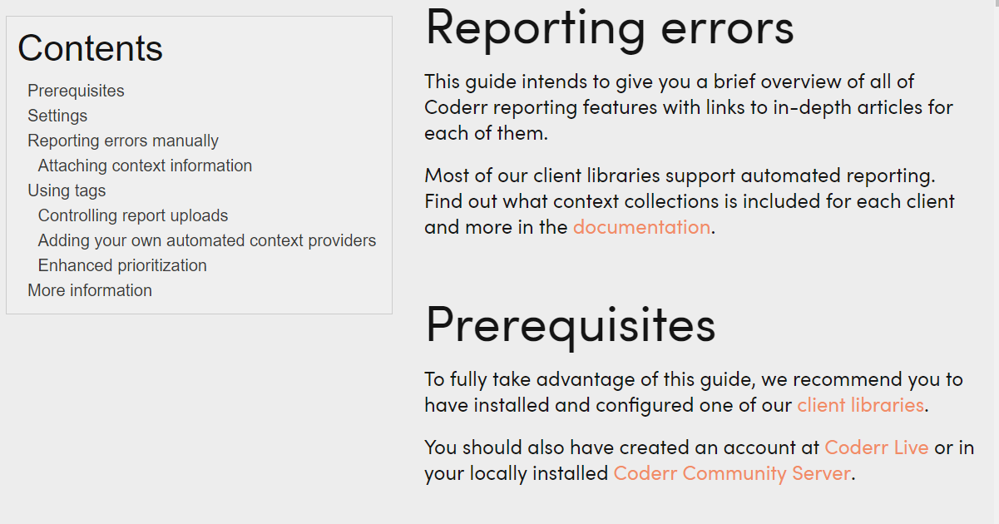

# MarkdownWeb

This project is a web page generator that uses Markdown as the format. You can use wiki link syntax
to link between different pages. It also supports editing of pages using a Markdown editor with preview support and syntax highlighting.

If you implement your repository you can also store page revisions (to get a complete wiki functionality).


[Live demo](http://coderr.io/documentation/) which is generated from [this documentation repository](https://github.com/coderrio/coderr.documentation).

## Screenshot



# Features

* All basic markdown formatters.
* Fenced codeblocks (with language specified as in Github pages)
* Github table format
* Links between markdown pages
* Local images
* Markdown editor
* Save/Edit pages

# Installation

**Basic installation**

    install-package markdownweb
	
# AspNet Core installation

Install the ASP.NET Core package: `markdownweb.aspnetcore`.

Add the following to `ConfigureServices()` in your `Startup.cs`:

```csharp
app.UseMarkdownWeb(options =>
{
    // URL to serve the markdown pages from
    options.Path = new PathString("/doc");
    
    // Location on disk
    options.DocumentationDirectory = @"D:\websites\mysite\wwwroot\docs";

    // To use a git repos:
    options.GitRepositoryUrl = "https://github.com/your/repository";
    
    // Where in the repos that the markdown files are located.
    options.GitSubFolder = @"docs\";
});
```

That's it.

## Customizing

MarkdownWeb supports for view engine files and plain HTML.

### View engine files

MarkdownWeb looks for "Views\Shared\Wiki.cshtml" per default, change it using `options.LayoutPage`.

View engine files, it must be placed where view engines normally look for it (typically `Views\`). By default, MarkdownWeb tries to find a view named `Views\Shared\Wiki.cshtml`.

The model type is `MarkdownWeb.GeneratedPage`.

### HTML files

The page path is relative to the content root (i.e. root folder).

The template must contain a tag named `{Body}` which will be replaced with the Markdown generated HTML. You can also add the tags `{TableOfContents}`, `{Title}` and `{Abstract}`

# Manual installation
	
The `PageService` is the main class which takes care of all parsing. It do however need to know how to treat links and 
where it can load/store pages. It do therefore have two dependencies that you need to configure first.

## IPageRepository

The abstraction for the datastorage. The built in storage is using the harddrive for storage. You should specify which directory
the files can be stored in. The structure will mirror the structure you use when you create pages.

There is also a IPageRepository which pulls a git repository.

## IUrlConverter

As the markdown pages can be placed anywhere in your web site structure the library needs to know where the pages is located to make it's wiki links
url independent. That transaction is handled by the `IUrlConverter` interface.

For instance you might have the pages in `http://yoursite.com/doc/` while all web site links in the pages are relative to the doc root (`/`). Thus
when someone surfs to `http://yoursite.com/doc/users/create/` the library just want to see it as `/users/create`.

## Complete configuration

```csharp
var repository = new FileBasedRepository(@"C:\Web\MarkdownPages");
var converter = new UrlConverter(VirtualPathUtility.ToAbsolutePath("~/doc/"));
var service = new PageService(repository, converter);
```

Then you just need to pass an url to the service:

```csharp
var htmlPage = service.ParseUrl(Request.Url.AbsolutePath);
```

.. or just markdown:

```csharp
var htmlPage = service.ParseString("/doc/", myMarkdownDocument);
```

